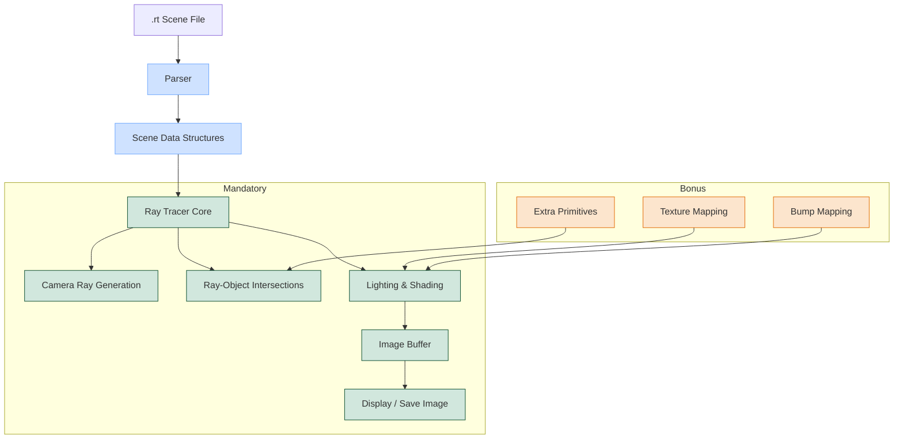

<h2 style="color:#e63946;">🚀 MiniRT </h2>

MiniRT is a 3D ray tracing renderer implemented in C. It renders 3D scenes defined in a custom scene description format (.rt files) using ray tracing techniques to produce realistic images with lighting, shadows, and surface reflections. This document provides a high-level overview of the system architecture, main components, and rendering pipeline.

## System Architecture

MiniRT is organized into two versions: a mandatory version with basic ray tracing functionality and a bonus version with extended features. Both versions share common utilities and data structures but implement different rendering capabilities.

## MiniRT Architecture

## Project Organization

#### The codebase is structured into three main directories:

### 1 -  _Shared_files:
=> Contains common utilities and data structures used by both versions.
### 2 -  _Mandatory:
=> Implements the basic ray tracing functionality.
### 3 - _Bonus: 
Implements the extended features (texture mapping, bump mapping, additional primitives).
