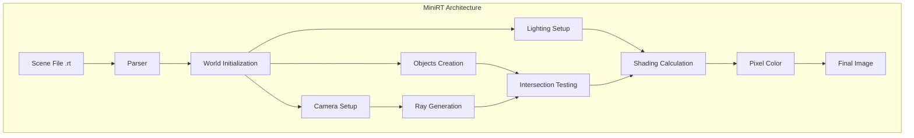
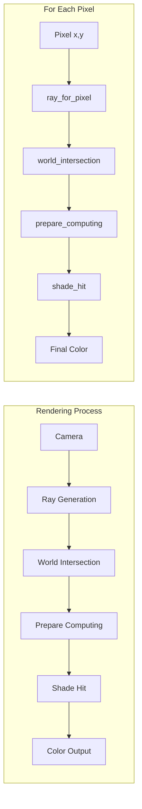

I understand you want to create a GitHub README.md file for your MiniRT ray tracing project. Based on your codebase, I'll create a comprehensive README with diagrams that explains the concepts and architecture.

# MiniRT - 3D Ray Tracing Engine


A high-performance 3D ray tracing renderer implemented in C that creates photorealistic images by simulating the physics of light. MiniRT supports multiple geometric primitives, advanced lighting models, and texture mapping.

## 🌟 Features

### Core Features
- **Ray Tracing Engine**: Full implementation of ray-object intersection algorithms
- **Multiple Primitives**: Spheres, planes, cylinders, and cones (bonus)
- **Phong Lighting Model**: Ambient, diffuse, and specular lighting
- **Shadow Calculation**: Realistic shadow rendering
- **Camera System**: Configurable viewpoint and field of view

### Advanced Features (Bonus)
- **Texture Mapping**: Apply 2D images to 3D surfaces [1](#1-0) 
- **Bump Mapping**: Surface detail simulation without geometric complexity [2](#1-1) 
- **Procedural Patterns**: Mathematical checkerboard patterns [3](#1-2) 
- **Additional Geometry**: Cone primitives for complex scenes

## 🏗️ Architecture



The project is organized into three main components:

- **`_Shared_files/`**: Common mathematical operations and geometric primitives [4](#1-3) 
- **`_Mandatory/`**: Core ray tracing functionality [5](#1-4) 
- **`_Bonus/`**: Extended features like textures and additional shapes [6](#1-5) 

## 🔬 Ray Tracing Pipeline



The rendering process follows these key steps:

1. **Ray Generation**: Cast rays from camera through each pixel [7](#1-6) 
2. **Intersection Testing**: Find closest object hit by each ray [8](#1-7) 
3. **Shading**: Calculate lighting at intersection points
4. **Shadow Testing**: Determine if points are occluded from light sources [9](#1-8) 

## 🎯 Geometric Primitives

### Sphere Intersection
Spheres use quadratic equation solving for ray intersection:

```mermaid
graph LR
    A[Ray] --> B[Transform to Object Space]
    B --> C[Quadratic Equation]
    C --> D[Discriminant Check]
    D --> E[Calculate t Values]
    E --> F[Return Intersection]
``` [10](#1-9) 

### Cylinder Creation
Cylinders are defined with position, orientation, and dimensions: [11](#1-10) 

## 🎨 Lighting Model

```mermaid
graph TD
    subgraph "Phong Lighting Model"
        A[Surface Point] --> B[Ambient Component]
        A --> C[Diffuse Component]
        A --> D[Specular Component]
        
        B --> E[Final Color]
        C --> E
        D --> E
        
        F[Light Source] --> C
        F --> D
        G[Surface Normal] --> C
        G --> D
        H[Eye Vector] --> D
    end
```

The lighting system combines:
- **Ambient**: Global illumination
- **Diffuse**: Surface brightness based on light angle
- **Specular**: Shiny reflections for glossy materials

## 📁 Project Structure

```
MiniRT/
├── _Shared_files/          # Common utilities
│   ├── sphere_intersection.c
│   ├── matrix_operations_1.c
│   └── ...
├── _Mandatory/             # Core implementation
│   ├── prog_files/
│   │   └── render.c
│   └── parse/
├── _Bonus/                 # Advanced features
│   ├── prog_files_bonus/
│   │   ├── render_bonus.c
│   │   └── texter_bonus.c
│   └── parse_bonus/
└── Makefile
```

## 🚀 Getting Started

### Prerequisites
- GCC compiler
- MLX42 graphics library
- Make

### Building

```bash
# Build mandatory version
make

# Build bonus version with advanced features
make bonus

# Clean build files
make clean
```

### Running

```bash
# Run with a scene file
./miniRT scenes/example.rt

# Bonus version
./miniRT_bonus scenes/textured_scene.rt
```

### Scene File Format

Create `.rt` files to define your 3D scenes:

```
A 0.2 255,255,255                    # Ambient lighting
C -50,0,20 0,0,0 70                  # Camera position, direction, FOV
L -40,0,30 0.7 255,255,255           # Light source

sp 0,0,20 20 255,0,0                 # Sphere: position, radius, color
pl 0,0,0 0,1.0,0 255,255,0           # Plane: position, normal, color
cy 50.0,0.0,20.6 0,0,1.0 14.2 21.42 10,0,255  # Cylinder
```

## 🔧 Mathematical Foundations

### Matrix Operations
4x4 matrices handle transformations: [12](#1-11) 

### Scene Parsing
The parser converts scene descriptions into internal data structures: [13](#1-12) 

## 🎯 Key Algorithms

### Shadow Calculation
Shadows are computed by casting rays from intersection points toward light sources to check for occlusion.

### Texture Mapping
The bonus version supports spherical texture mapping, converting 3D surface points to 2D texture coordinates using spherical mathematics.

## 🤝 Contributing

1. Fork the repository
2. Create a feature branch (`git checkout -b feature/amazing-feature`)
3. Commit your changes (`git commit -m 'Add amazing feature'`)
4. Push to the branch (`git push origin feature/amazing-feature`)
5. Open a Pull Request

## 📄 License

This project is licensed under the MIT License - see the [LICENSE](LICENSE) file for details.

## 🙏 Acknowledgments

- 42 School for the project specifications
- Computer graphics community for ray tracing algorithms
- MLX42 library for graphics rendering

---

**Note**: This project demonstrates fundamental computer graphics concepts including 3D mathematics, lighting models, and rendering algorithms. The bonus features showcase advanced techniques like texture mapping and procedural generation commonly used in modern rendering engines.

Wiki pages you might want to explore:
- [Overview (moh3333/minirt)](/wiki/moh3333/minirt#1)
- [Advanced Camera Features (moh3333/minirt)](/wiki/moh3333/minirt#5.2)
