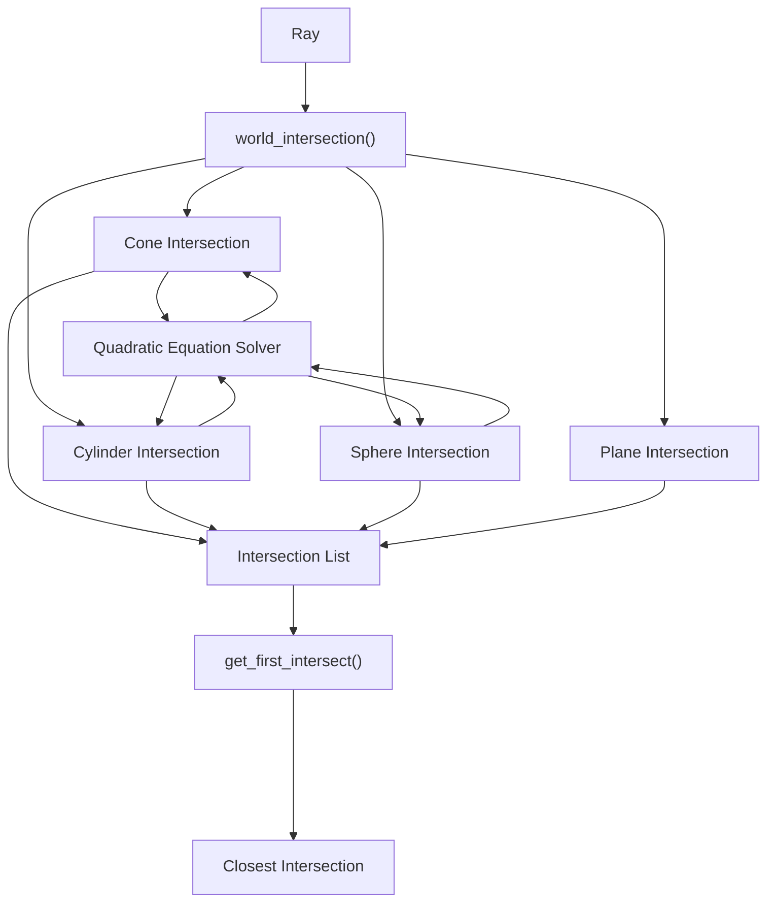

# MiniRT

MiniRT is a 3D ray tracing renderer implemented in C. It renders 3D scenes defined in a custom scene description format (.rt files) using ray tracing techniques to produce realistic images with lighting, shadows, and surface reflections. This document provides a high-level overview of the system architecture, main components, and rendering pipeline.

## System Architecture:

MiniRT is organized into two versions: a mandatory version with basic ray tracing functionality and a bonus version with extended features. Both versions share common utilities and data structures but implement different rendering capabilities.

## Project Organization:

#### The codebase is structured into three main directories:

### 1 -  _Shared_files:
    Contains common utilities and data structures used by both versions.

### 2 -  _Mandatory:
    Implements the basic ray tracing functionality.

### 3 - _Bonus: 
    Implements the extended features (texture mapping, bump mapping, additional primitives).

## Ray Tracing Pipeline:

MiniRT follows a standard ray tracing pipeline. The system traces rays from the camera through each pixel in the image plane into the scene, calculates intersections with objects, and determines the color of each pixel based on lighting, material properties, and shadows.

## Geometric Primitives:

MiniRT supports multiple geometric primitives, each with its own intersection logic:

### 1 - Spheres: 
    Defined by a center point and radius

### 2 - Planes: 
    Defined by a point and normal vector

### 3 - Cylinders: 
    Defined by a center axis, diameter, and height

### 4 - Cones (Bonus): 
    Defined by a center axis, diameter, and height

All primitives share a common structure that includes:

    Transformation matrices for positioning and scaling

    Material properties for appearance

    Ray intersection calculations

    Surface normal calculations

Each primitive implements its own intersection algorithm with rays, which is used by the ray tracer to determine visibility and shading.

##Ray-Object Intersection System:

### The intersection testing system processes each primitive differently based on its type, but follows a common pattern:

#### 1 - Transform the ray to object space
#### 2 - Calculate intersection(s)
#### 3 - Validate intersection points
#### 4 - Create intersection records
#### 5 - Find the closest valid intersection

## Lighting and Shading:

# MiniRT

MiniRT is a 3D ray tracing renderer implemented in C. It renders 3D scenes defined in a custom scene description format (.rt files) using ray tracing techniques to produce realistic images with lighting, shadows, and surface reflections. This document provides a high-level overview of the system architecture, main components, and rendering pipeline.

## System Architecture:

MiniRT is organized into two versions: a mandatory version with basic ray tracing functionality and a bonus version with extended features. Both versions share common utilities and data structures but implement different rendering capabilities.

## Project Organization:

#### The codebase is structured into three main directories:

### 1 -  _Shared_files:
    Contains common utilities and data structures used by both versions.

### 2 -  _Mandatory:
    Implements the basic ray tracing functionality.

### 3 - _Bonus: 
    Implements the extended features (texture mapping, bump mapping, additional primitives).

## Ray Tracing Pipeline:

MiniRT follows a standard ray tracing pipeline. The system traces rays from the camera through each pixel in the image plane into the scene, calculates intersections with objects, and determines the color of each pixel based on lighting, material properties, and shadows.

## Geometric Primitives:

MiniRT supports multiple geometric primitives, each with its own intersection logic:

### 1 - Spheres: 
    Defined by a center point and radius

### 2 - Planes: 
    Defined by a point and normal vector

### 3 - Cylinders: 
    Defined by a center axis, diameter, and height

### 4 - Cones (Bonus): 
    Defined by a center axis, diameter, and height

All primitives share a common structure that includes:

    Transformation matrices for positioning and scaling

    Material properties for appearance

    Ray intersection calculations

    Surface normal calculations

Each primitive implements its own intersection algorithm with rays, which is used by the ray tracer to determine visibility and shading.

##Ray-Object Intersection System:

### The intersection testing system processes each primitive differently based on its type, but follows a common pattern:

#### 1 - Transform the ray to object space
#### 2 - Calculate intersection(s)
#### 3 - Validate intersection points
#### 4 - Create intersection records
#### 5 - Find the closest valid intersection

## Lighting and Shading:

# MiniRT

MiniRT is a 3D ray tracing renderer implemented in C. It renders 3D scenes defined in a custom scene description format (.rt files) using ray tracing techniques to produce realistic images with lighting, shadows, and surface reflections. This document provides a high-level overview of the system architecture, main components, and rendering pipeline.

## System Architecture:

MiniRT is organized into two versions: a mandatory version with basic ray tracing functionality and a bonus version with extended features. Both versions share common utilities and data structures but implement different rendering capabilities.

## Project Organization:

#### The codebase is structured into three main directories:

### 1 -  _Shared_files:
    Contains common utilities and data structures used by both versions.

### 2 -  _Mandatory:
    Implements the basic ray tracing functionality.

### 3 - _Bonus: 
    Implements the extended features (texture mapping, bump mapping, additional primitives).

## Ray Tracing Pipeline:

MiniRT follows a standard ray tracing pipeline. The system traces rays from the camera through each pixel in the image plane into the scene, calculates intersections with objects, and determines the color of each pixel based on lighting, material properties, and shadows.

## Geometric Primitives:

MiniRT supports multiple geometric primitives, each with its own intersection logic:

### 1 - Spheres: 
    Defined by a center point and radius

### 2 - Planes: 
    Defined by a point and normal vector

### 3 - Cylinders: 
    Defined by a center axis, diameter, and height

### 4 - Cones (Bonus): 
    Defined by a center axis, diameter, and height

All primitives share a common structure that includes:

    Transformation matrices for positioning and scaling

    Material properties for appearance

    Ray intersection calculations

    Surface normal calculations

Each primitive implements its own intersection algorithm with rays, which is used by the ray tracer to determine visibility and shading.

##Ray-Object Intersection System:

### The intersection testing system processes each primitive differently based on its type, but follows a common pattern:

#### 1 - Transform the ray to object space
#### 2 - Calculate intersection(s)
#### 3 - Validate intersection points
#### 4 - Create intersection records
#### 5 - Find the closest valid intersection

## Lighting and Shading:
